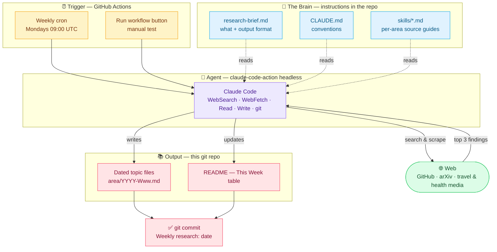

<div align="center">

# 🧠 mai_pkb

### My Personal Knowledge Base

*A living record of the latest research, ideas, and industry trends worth tracking.*


</div>

---

## 🗓️ This Week

> **This week's research brief:** _(first run pending — Claude writes a 2–3 sentence overview of the week's top findings here.)_

| Focus Area | Summary | File |
| --- | --- | --- |
| 🍜 Southeast Asian Food & Culture | _(first run pending)_ | — |
| 🤖 AI Engineering | _(first run pending)_ | — |
| 📊 Data Science | _(first run pending)_ | — |
| 🏥 Healthcare | _(first run pending)_ | — |

*(Claude replaces this section each week with the latest update.)*

---

## 🎯 Focus Areas

| Area | What I'm tracking |
| --- | --- |
| 🍜 **Southeast Asian Food & Culture** | Food systems, nutrition, ingredients, culture, and industry developments across Southeast Asia |
| 🤖 **AI Engineering** | Models, tooling, frameworks, and practical patterns for building with AI |
| 📊 **Data Science** | Methods, techniques, and applied work across the field |
| 🏥 **Healthcare Trends** | Developments, research, and market movement in the healthcare sector |

---

## 📌 Purpose

This repo is where I collect and organize notes, papers, articles, and takeaways as I follow these topics over time. It's a growing reference for myself — not a polished publication.

---

## 🔄 Updates

> This knowledge base is **updated weekly by Claude** and published with summaries of the **top 3 developments** across the focus areas each week — the most notable research and industry moves worth knowing.

---

## 🗂️ Structure

Notes are organized by focus area. *(More structure to come as the knowledge base grows.)*

```
mai_pkb/
├── .github/workflows/
│   └── weekly-research.yml   # the weekly trigger (GitHub Actions cron)
├── research-brief.md         # what to research + output format (the "brain")
├── CLAUDE.md                 # standing conventions
├── 🍜 sea-food-culture/      # Southeast Asian food, culture & industry
├── 🤖 ai-engineering/        # AI models, tools, and engineering practices
├── 📊 data-science/          # Data science methods and applied work
└── 🏥 healthcare/            # Healthcare industry trends and research
```

Each week, Claude drops a dated file (`{area}/{year}-W{week}.md`) for the top items and updates the Weekly Log below.

---

## ⚙️ How the automation works

A scheduled research agent — no laptop cron or server needed. GitHub hosts everything.



1. **`.github/workflows/weekly-research.yml`** runs on a cron (Mondays 09:00 UTC), with a manual **Run workflow** button for testing.
2. It launches **`anthropics/claude-code-action`** headless with the prompt *"Follow the instructions in research-brief.md"*.
3. Claude searches the web, writes the topic files, updates this README's Weekly Log, and commits.

### One-time setup

1. Push this repo to GitHub.
2. Add your Anthropic API key as a repo secret named **`ANTHROPIC_API_KEY`** (Settings → Secrets and variables → Actions).
3. Run **`/install-github-app`** from Claude Code (installs the GitHub App; needs repo admin).
4. Open the **Actions** tab → **Weekly Research** → **Run workflow** to test without waiting for Monday.

### Two decisions to make

- **Auto-commit vs. review:** the workflow commits straight to `main`. To sanity-check first, have the brief open a **pull request** instead — then your weekly ritual is merging one PR.
- **Topic weighting:** the brief currently weights all four areas evenly (top 3 overall). Adjust `research-brief.md` to favor specific areas or sources.

---

## ✍️ Conventions

- 📄 One topic per note where practical
- 🔗 Link related notes to build connections over time
- 🏷️ Capture the source and date for anything worth citing later
- 🚫 Never invent links or facts — primary sources only

<div align="center">

---

*Curated by Mai with Claude.* 💜

</div>
