<div align="center">

# 🧠 mai_pkb

### My Personal Knowledge Base

*A living record of the latest research, ideas, and industry trends worth tracking.*


</div>

---

## 🗓️ This Week

> **This week's research brief (2026-W38):** After a month of frontier launches, this week's top three are all about **who sets the defaults** once the models are a commodity. **ARPA-H launched ADVOCATE** (9–11 Sep), a four-year **$62.7M** program to build an **FDA-authorized** agentic AI that manages heart-failure patients between visits — a federal agency underwriting the regulatory pathway for autonomous clinical care rather than waiting to regulate it, with UpDoc, Tempus AI and Atman Health first in line. **DeepSeek shipped V4.1-Flash** (10 Sep) under MIT — a 552B MoE claimed to beat its own much larger V4-Pro, which **from 14 Sep silently absorbs V4-Pro API traffic at Flash prices**, retiring the flagship into the small model. And **OpenAI now maintains a first-party Codex plugin catalog** with a declared `.codex-plugin/plugin.json` manifest, turning the community skill-bundle convention this KB has tracked since W36 into a vendor-owned format — on a GitHub trending page that is now, by volume, a skills marketplace.

| Focus Area | Summary | File |
| --- | --- | --- |
| 🤖 AI Engineering | **DeepSeek-V4.1-Flash** (10 Sep, MIT, 552B MoE, 1M context) takes over V4-Pro's API traffic at Flash rates from the 14th; **OpenAI's official Codex plugin catalog** gives the packaged-skill unit a manifest format, while trending is now mostly skill bundles (`archify` at **61.8k ★**, +10.1k for a third straight week). | [2026-W38](ai-engineering/2026-W38.md) |
| 🏥 Healthcare | **ARPA-H's $62.7M ADVOCATE program** bets on an FDA-authorized autonomous agent for heart failure (UpDoc $9M, Tempus $9.5M, Atman Health); **AstraZeneca's camizestrant missed its primary endpoints** in pivotal SERENA-4, and **Scholar Rock** won the first SMA approval aimed at muscle loss. | [2026-W38](healthcare/2026-W38.md) |

**📁 Previous weeks:** every brief is archived as a dated file (`{year}-W{week}.md`) inside its focus-area directory — browse either folder to read back through the weeks:

- [`ai-engineering/`](ai-engineering/) — all AI Engineering briefs
- [`healthcare/`](healthcare/) — all Healthcare briefs

*(Claude replaces the brief and table above each week; this archive pointer stays.)*

---

## 🎯 Focus Areas

| Area | What I'm tracking |
| --- | --- |
| 🤖 **AI Engineering** | Models, tooling, frameworks, and practical patterns for building with AI |
| 🏥 **Healthcare Trends** | Regulatory change first (FDA, CMS, HHS, legislation) — then industry moves, market movement, and research |

---

## 📌 Purpose

This repo is where I collect and organize notes, papers, articles, and takeaways as I follow these topics over time. It's a growing reference for myself — not a polished publication.

---

## 🔄 Updates

> This knowledge base is **updated weekly by Claude** and published with summaries of the **top 3 developments** each week — the most notable research and industry moves worth knowing. Deliberately narrow: two focus areas, both covered every week, inside a bounded per-run budget (see [GOVERNOR.md](GOVERNOR.md)).

---

## 🗂️ Structure

Notes are organized by focus area. *(More structure to come as the knowledge base grows.)*

```
mai_pkb/
├── .github/workflows/
│   └── weekly-research.yml   # the weekly trigger + the governor's dials
├── research-brief.md         # what to research + output format (the "brain")
├── skills/                   # per-area source guides
├── GOVERNOR.md               # how each run's spend is bounded
├── .governor/run-log.csv     # turns / cost / outcome, one row per run
├── CLAUDE.md                 # standing conventions
├── 🤖 ai-engineering/        # AI models, tools, and engineering practices
└── 🏥 healthcare/            # Healthcare regulation, industry trends, and research
```

Each week, Claude drops a dated file (`{area}/{year}-W{week}.md`) for the top items and refreshes the **This Week** section above.

---

## ⚙️ How the automation works

A scheduled research agent — no laptop cron or server needed. GitHub hosts everything.

```mermaid
%%{init: {'theme':'base','themeVariables':{'fontFamily':'ui-sans-serif, system-ui, -apple-system, sans-serif','fontSize':'13px','lineColor':'#94a3b8'},'flowchart':{'curve':'basis','nodeSpacing':40,'rankSpacing':70,'padding':14}}}%%
flowchart LR
    subgraph S1[" ⏰ TRIGGER "]
        direction TB
        CRON["🗓️ Weekly cron<br/>Mondays 09:00 UTC"]
        RETRY["🔁 Retry cron<br/>Tuesdays · no-ops if Monday landed"]
        MANUAL["👆 Run workflow<br/>manual dispatch"]
    end

    subgraph S2[" 🎛️ GOVERNOR "]
        direction TB
        PLAN["📋 Plan the run<br/>ISO week · scope<br/>skip if already published"]
        CAPS["🚧 Hard caps<br/>max-turns · timeout<br/>concurrency · budget"]
    end

    subgraph S3[" 🤖 AGENT "]
        direction TB
        CLAUDE["Claude Code · headless<br/>claude-code-action<br/>WebSearch · WebFetch · Read · Write · git"]
    end

    subgraph S4[" 📚 OUTPUT "]
        direction TB
        FILES["📄 Dated briefs<br/>area/YYYY-Www.md"]
        RDME["📌 README<br/>This Week table"]
    end

    BRAIN[["🧠 THE BRAIN<br/>research-brief.md · CLAUDE.md · skills/*.md"]]
    WEB{{"🌐 WEB SOURCES<br/>GitHub · arXiv · FDA / CMS / HHS · health media"}}
    REPO[("✅ git repo<br/>commit after each area")]
    LOG[("📊 run-log.csv<br/>turns · cost · outcome")]

    CRON   --> PLAN
    RETRY  --> PLAN
    MANUAL --> PLAN
    PLAN   -->|"➊ scope + ISO week"| CAPS
    CAPS   -->|"➋ launch under caps"| CLAUDE
    BRAIN  -.->|"➌ loads instructions"| CLAUDE
    CLAUDE <-->|"➍ search · scrape"| WEB
    CLAUDE -->|"➎ writes"| FILES
    CLAUDE -->|"➏ refreshes"| RDME
    FILES  --> REPO
    RDME   --> REPO
    CLAUDE -.->|"➐ accounting"| LOG

    classDef trig  fill:#fef3c7,stroke:#f59e0b,stroke-width:1.5px,color:#78350f;
    classDef gov   fill:#e2e8f0,stroke:#64748b,stroke-width:1.5px,color:#1e293b;
    classDef agent fill:#ede9fe,stroke:#8b5cf6,stroke-width:1.5px,color:#4c1d95;
    classDef brain fill:#e0f2fe,stroke:#0ea5e9,stroke-width:1.5px,color:#075985;
    classDef web   fill:#dcfce7,stroke:#22c55e,stroke-width:1.5px,color:#14532d;
    classDef out   fill:#ffe4e6,stroke:#f43f5e,stroke-width:1.5px,color:#881337;
    classDef store fill:#f1f5f9,stroke:#475569,stroke-width:1.5px,color:#0f172a;

    class CRON,RETRY,MANUAL trig;
    class PLAN,CAPS gov;
    class CLAUDE agent;
    class BRAIN brain;
    class WEB web;
    class FILES,RDME out;
    class REPO,LOG store;

    style S1 fill:#fffbeb,stroke:#f59e0b,stroke-width:2px,color:#78350f;
    style S2 fill:#f8fafc,stroke:#64748b,stroke-width:2px,color:#1e293b;
    style S3 fill:#faf5ff,stroke:#8b5cf6,stroke-width:2px,color:#4c1d95;
    style S4 fill:#fff1f2,stroke:#f43f5e,stroke-width:2px,color:#881337;
```



**⏰ Trigger** — [`.github/workflows/weekly-research.yml`](.github/workflows/weekly-research.yml) fires on a cron (Mondays 09:00 UTC), with a Tuesday retry and a manual **Run workflow** button.

➊ **Plan the run** — resolves this week's ISO week, scope, and dated filenames, and skips the whole run if the week already published.<br/>
➋ **Launch under caps** — starts **`anthropics/claude-code-action`** headless with the areas, the ISO week, and a per-area search/fetch budget, bounded by a hard turn cap and job timeout.<br/>
➌ **Load the Brain** — Claude reads [`research-brief.md`](research-brief.md), [`CLAUDE.md`](CLAUDE.md), and the per-area guides in [`skills/`](skills/).<br/>
➍ **Research** — WebSearch and WebFetch against the sources each skill prioritizes, until the budget is spent.<br/>
➎➏ **Write** — the dated brief for each area, then this README's *This Week* table — **committing after each area**, so a run cut short still publishes what it finished.<br/>
➐ **Accounting** — records turns, cost, and why the run ended in [`.governor/run-log.csv`](.governor/run-log.csv) and the job summary.

See [GOVERNOR.md](GOVERNOR.md) for the dials and how to turn them.

### One-time setup

1. Push this repo to GitHub.
2. Generate a Claude Code token: run **`claude setup-token`** locally (uses your Claude Pro/Max subscription — no API billing).
3. Add it as a repo secret named **`CLAUDE_CODE_OAUTH_TOKEN`** (Settings → Secrets and variables → Actions).
4. Run **`/install-github-app`** from Claude Code (installs the GitHub App; needs repo admin).
5. Open the **Actions** tab → **Weekly Research** → **Run workflow** to test without waiting for Monday.

### Two decisions to make

- **Auto-commit vs. review:** the workflow commits straight to `main`. To sanity-check first, have the brief open a **pull request** instead — then your weekly ritual is merging one PR.
- **Topic scope:** two areas, both covered weekly. To add or drop one, change `GOV_AREAS` in the workflow and the area list in `research-brief.md` (and add a `skills/` guide for anything new).

---

## ✍️ Conventions

- 📄 One topic per note where practical
- 🔗 Link related notes to build connections over time
- 🏷️ Capture the source and date for anything worth citing later
- 🚫 Never invent links or facts — primary sources only

<div align="center">

---

*Curated by Mai with Claude.* 💜

</div>
