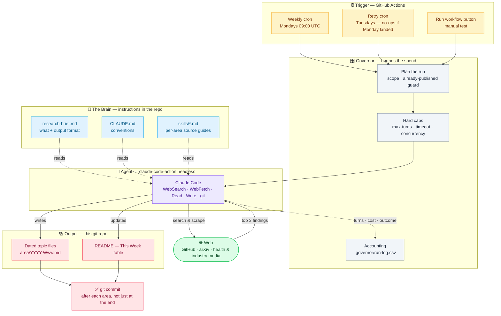

<div align="center">

# 🧠 mai_pkb

### My Personal Knowledge Base

*A living record of the latest research, ideas, and industry trends worth tracking.*


</div>

---

## 🗓️ This Week

> **This week's research brief (2026-W35):** The week's biggest development was clinical — on 19 August, Merck and Moderna reported that **intismeran autogene plus KEYTRUDA met both endpoints in Phase 3** (INTerpath-001, n=1,137, resected stage IIB–IV melanoma): the first positive Phase 3 for an individualized mRNA neoantigen therapy, and the first to beat KEYTRUDA alone in adjuvant melanoma. In AI engineering, the through-line shifted from what an agent *remembers* to what it can be *extended with*: DeepSeek's MIT-licensed **deepseek-harness** ("Everything is a Plugin", 190.2k ★) trended alongside its underlying framework **cordis** (+2,725) and two vendor plugin registries from Anthropic and Cursor. Whether those registries converge on MCP or fragment into per-harness extension APIs is the thing to watch next.

| Focus Area | Summary | File |
| --- | --- | --- |
| 🤖 AI Engineering | The agent harness became a plugin platform — deepseek-harness (190.2k ★, MIT, dev preview), cordis (+2,725) and the Anthropic/Cursor plugin registries all trended together. | [2026-W35](ai-engineering/2026-W35.md) |
| 🏥 Healthcare | Merck/Moderna's individualized mRNA therapy met RFS and DMFS endpoints in Phase 3 melanoma (HRs undisclosed); health IT spent the week consolidating — Hinge Health–Cylinder ($105M), iRhythm–VitalConnect, Kyndryl, Providence Equity. | [2026-W35](healthcare/2026-W35.md) |

*(Claude replaces this section each week with the latest update.)*

---

## 🎯 Focus Areas

| Area | What I'm tracking |
| --- | --- |
| 🤖 **AI Engineering** | Models, tooling, frameworks, and practical patterns for building with AI |
| 🏥 **Healthcare Trends** | Developments, research, and market movement in the healthcare sector |

---

## 📌 Purpose

This repo is where I collect and organize notes, papers, articles, and takeaways as I follow these topics over time. It's a growing reference for myself — not a polished publication.

---

## 🔄 Updates

> This knowledge base is **updated weekly by Claude** and published with summaries of the **top 3 developments** each week — the most notable research and industry moves worth knowing. Deliberately narrow: two focus areas, both covered every week, inside a bounded per-run budget (see [GOVERNOR.md](GOVERNOR.md)).

---

## 🗂️ Structure

Notes are organized by focus area. *(More structure to come as the knowledge base grows.)*

```
mai_pkb/
├── .github/workflows/
│   └── weekly-research.yml   # the weekly trigger + the governor's dials
├── research-brief.md         # what to research + output format (the "brain")
├── skills/                   # per-area source guides
├── GOVERNOR.md               # how each run's spend is bounded
├── .governor/run-log.csv     # turns / cost / outcome, one row per run
├── CLAUDE.md                 # standing conventions
├── 🤖 ai-engineering/        # AI models, tools, and engineering practices
└── 🏥 healthcare/            # Healthcare industry trends and research
```

Each week, Claude drops a dated file (`{area}/{year}-W{week}.md`) for the top items and refreshes the **This Week** section above.

---

## ⚙️ How the automation works

A scheduled research agent — no laptop cron or server needed. GitHub hosts everything.



1. **`.github/workflows/weekly-research.yml`** runs on a cron (Mondays 09:00 UTC), with a Tuesday retry and a manual **Run workflow** button.
2. The **Plan the run** step resolves this week's scope and dated filenames, and skips the whole run if the week already published.
3. It launches **`anthropics/claude-code-action`** headless, handing Claude the areas, the ISO week, and a search/fetch budget — under a hard turn cap and job timeout.
4. Claude searches the web, writes each topic file, **commits after each area**, then updates this README's *This Week* section.
5. The **accounting** step records turns, cost, and why the run ended in [`.governor/run-log.csv`](.governor/run-log.csv) and the job summary.

See [GOVERNOR.md](GOVERNOR.md) for the dials and how to turn them.

### One-time setup

1. Push this repo to GitHub.
2. Generate a Claude Code token: run **`claude setup-token`** locally (uses your Claude Pro/Max subscription — no API billing).
3. Add it as a repo secret named **`CLAUDE_CODE_OAUTH_TOKEN`** (Settings → Secrets and variables → Actions).
4. Run **`/install-github-app`** from Claude Code (installs the GitHub App; needs repo admin).
5. Open the **Actions** tab → **Weekly Research** → **Run workflow** to test without waiting for Monday.

### Two decisions to make

- **Auto-commit vs. review:** the workflow commits straight to `main`. To sanity-check first, have the brief open a **pull request** instead — then your weekly ritual is merging one PR.
- **Topic scope:** two areas, both covered weekly. To add or drop one, change `GOV_AREAS` in the workflow and the area list in `research-brief.md` (and add a `skills/` guide for anything new).

---

## ✍️ Conventions

- 📄 One topic per note where practical
- 🔗 Link related notes to build connections over time
- 🏷️ Capture the source and date for anything worth citing later
- 🚫 Never invent links or facts — primary sources only

<div align="center">

---

*Curated by Mai with Claude.* 💜

</div>
